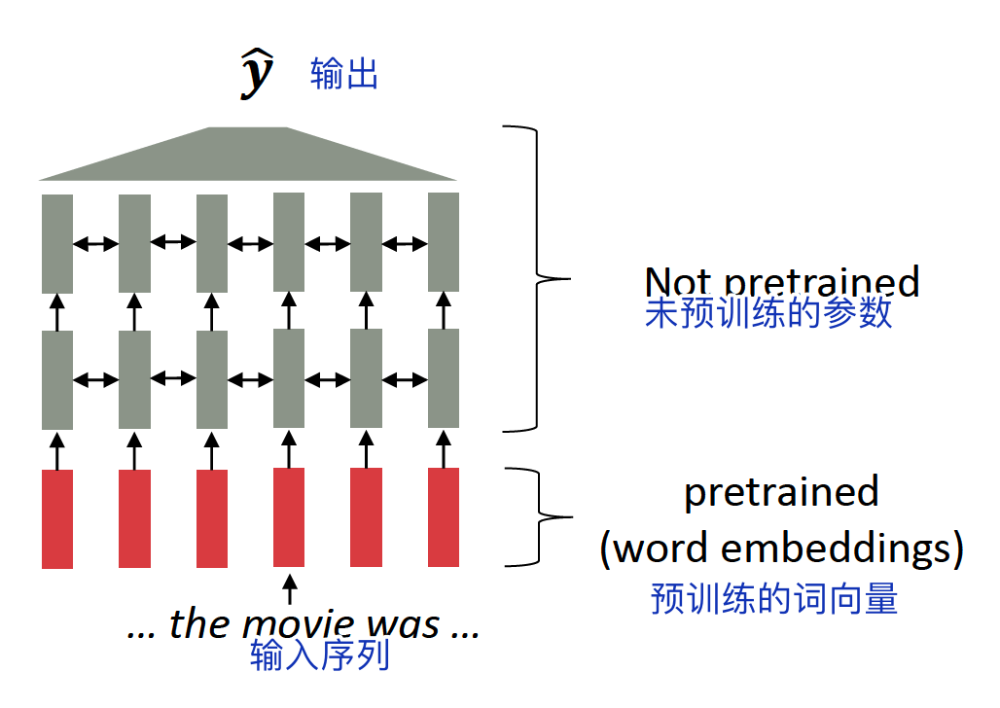
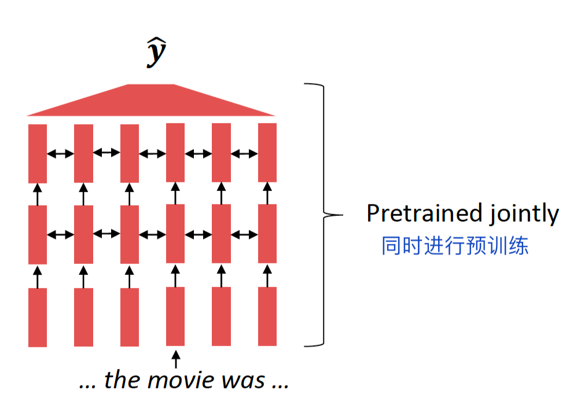
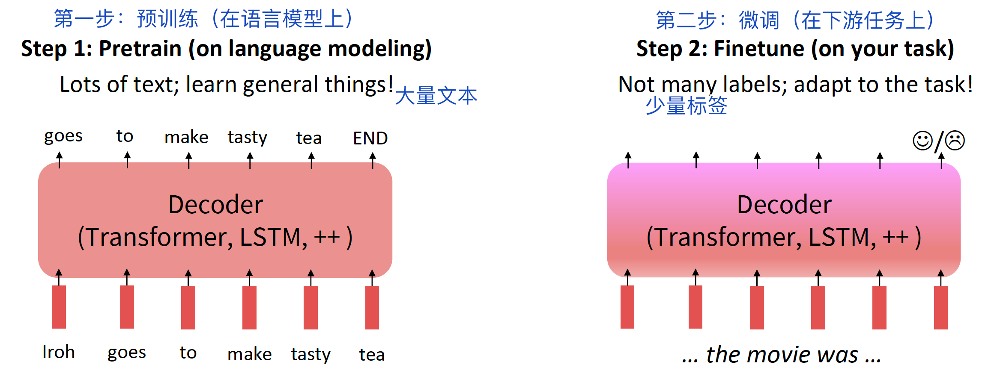
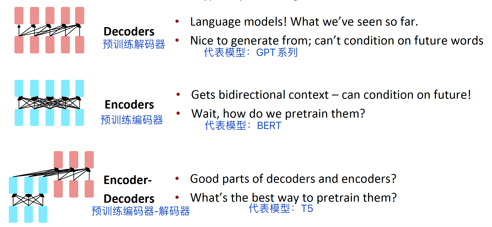
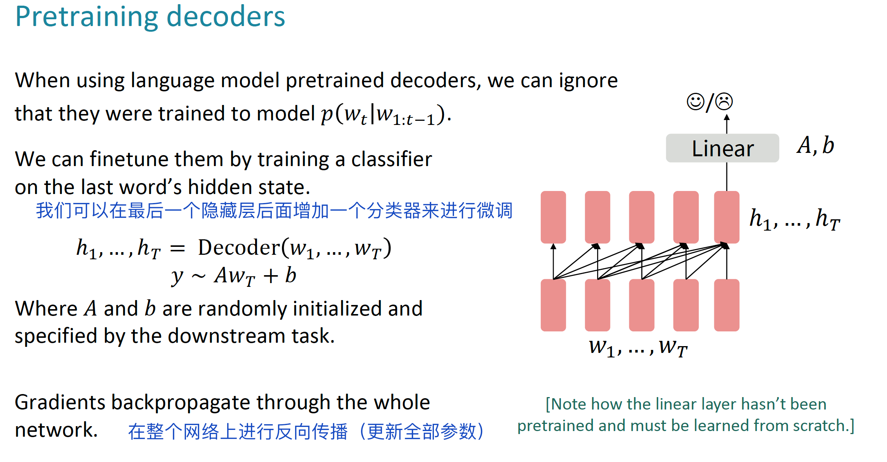
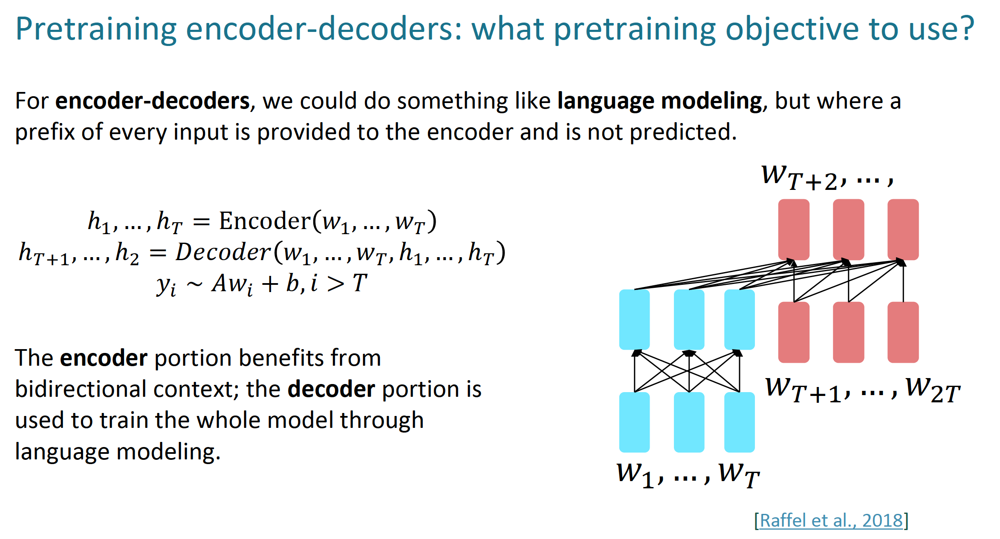

# Lecture10: 预训练

## 本节主要内容

- 子词模型回顾
- 预训练的3种方法

## 1 子词模型回顾

### 1.1 独热编码

假设我们有一个固定的词表，那么：

这种词表示方法的效果不是很好，因为单词有非常多的形态。

### 1.2 字节对编码算法

一种解决思路是字节对编码（byte-pair encoding algorithm），它把单词分解成一系列的子词（subwords）组成的序列，这样稀有词就可以被表示。

## 2 从词向量中获得模型预训练的启发

### 2.1 预训练词向量

大约2017开始，开始预训练词向量（没有背景信息）：

### 2.2 预训练模型整体

在现在的NLP中，所有参数都通过预训练进行初始化。

### 2.3 预训练/微调范式

预训练通过模型初始化来提升NLP任务的应用效果。

### 2.4 随机梯度下降和预训练/微调

从神经网络的训练角度看，为什么预训练/微调是有效的？

假设参数$\hat{𝜃}$可以最小化预训练阶段的损失函数$min_𝜃ℒ_{pretrain}(𝜃)$，那么微调阶段的损失函数$min_𝜃ℒ_{fineturn}(𝜃)$从$\hat{𝜃}$开始进行初始化。

> *这两句话不是很理解*。

## 3 三种预训练方法

### 3.1 解码器

### 3.2 编码器

### 3.3 编码器-解码器

