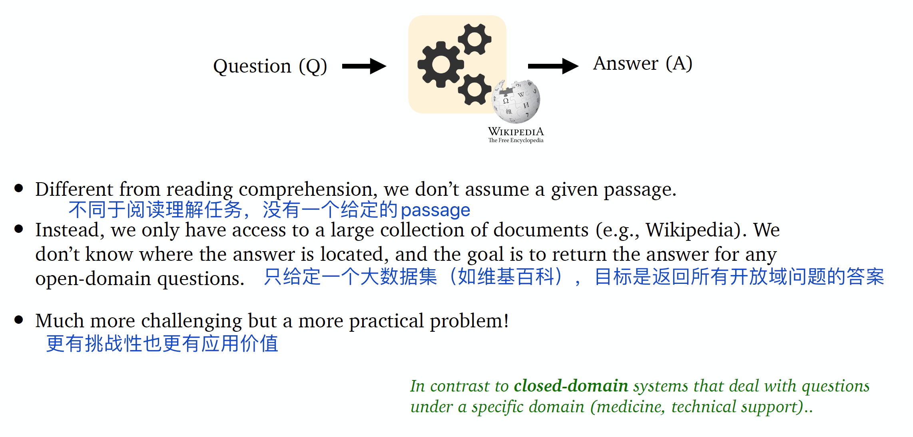
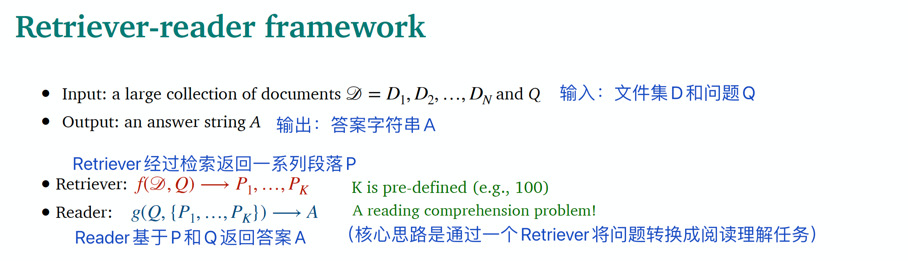

# Lecture11: 问答系统

## 本节主要内容

- 问答系统简介
- 阅读理解任务
- 开放领域的问答任务

教授：[Danqi Chen](https://scholar.google.com/citations?user=sVR8ktkAAAAJ&hl=zh-CN)

## 1 问答简介

### 1.1 问答的定义

### 1.2 问答的分类

按问答系统使用的信息来源来看，有文章文本、网页文本、知识库、表格、图像等；

按问题类型来看，有事实性或非事实性问题、开放域或封闭域问题、单一问题或组合问题；

从回答类型来看，有摘要、段落、列表、对错等。

### 1.3 问答的应用

- 搜索引擎
- 语音助手

进入深度学习时代后，几乎所有最先进的问答系统都建立在端到端训练和预训练的语言模型之上（例如，BERT）。

### 1.4 文本问答之外

本节重点是基于非结构化文本的问答系统。

非结构化文本之外，还有基于数据库/知识库的问答、视觉问答等领域。

## 2 阅读理解任务

### 2.1 阅读理解定义

阅读理解任务是自然语言理解的重要应用，很多NLP任务可以转化为阅读理解，例如信息抽取、语义标注等。

### 2.2 斯坦福QA数据集（SQuAD）

SQuAD是2016年由斯坦福大学的研究者建立的问答数据集。

*（所以只用了那些能用原文回答的问题）*

SQuAD有两个评估指标：

- EM（精确匹配，Exact Match）（0 或 1）
- F1（具体计算方式参考原论文）

### 2.3 阅读理解建模

解决该任务主要有两类模型：

### 2.4 seq2seq回顾：机器翻译与阅读理解的异同

- 机器翻译中，有source sentence和target sentence；阅读理解也有两段文本：passage和question（字数不均衡）。

- 机器翻译中，需要找到与target word相关的source word；阅读理解中，需要找到与question最相关的passage中的单词。（都需要注意力机制来实现）
- 机器翻译需要解码器生成答案；但是阅读理解任务需要两个分类器预测答案的起始位置和结束位置。

### 2.5 BiDAF模型

BiDAF: the Bidirectional Attention Flow model

整体架构如下：

#### 2.5.1 编码层：Encoding

#### 2.5.2 注意力层：Attention

两种注意力：

- Context-to-query attention: 对于每个context word，从query words中选择最相关的词。

  

- Query-to-context attention: 选择与 query words最相关的context words。

  

注意力可视化：

#### 2.5.3 输出层：Modeling and output layers

- Modeling layer: 两层双向LSTM网络。

  

- Output layer：两个分类器，分别预测起始位置和结束位置。

  

### 2.6 BERT模型

BERT做阅读理解任务，思路如下：

### 2.7 BiDAF和BERT的异同

不同点：

- BERT参数更多
- BiDAF基于BiLSTM，BERT基于Transformer
- BERT经过预训练，而BiDAF除了用GloVe进行编码外，其他参数都只是从该任务的监督数据集上学到的

相同点：

（BERT叠加了更多的attention（自注意力），研究表明，向BiDAF增加自注意力层也能提升效果。）

此外，SpanBERT（如下图）通过改变mask数据和训练任务也能提升效果：

- 用连续mask取代随机mask
- 用span的两个节点预测所有mask的单词。（相当于把span的信息压缩到两个节点中）

## 3 开放领域的问答任务

### 3.1 开放域问答的特点

### 3.2 Retriever-reader架构

参考文献：Chen et al., 2017. Reading Wikipedia to Answer Open-domain Questions 

### 3.3 开放域问答最新进展

Recent work[1] shows that it is beneficial to generate answers instead of to extract answers. 

Large language models can do open-domain QA well without an explicit retriever stage[2].

Maybe the reader model is not necessary too[3-4]. It is possible to encode all the phrases (60 billion phrases in Wikipedia) using **dense** vectors and only do nearest neighbor search without a BERT model at inference time! 

- 参考文献

>  [1] Izacard and Grave 2020. Leveraging Passage Retrieval with Generative Models for Open Domain Question Answering 
>
> [2] Roberts et al., 2020. How Much Knowledge Can You Pack Into the Parameters of a Language Model? 
>
> [3] Seo et al., 2019. Real-Time Open-Domain Question Answering with Dense-Sparse Phrase Index 
>
> [4] Lee et al., 2020. Learning Dense Representations of Phrases at Scale 

深入了解的话见[Danqi Chen](https://scholar.google.com/citations?user=sVR8ktkAAAAJ&hl=zh-CN)的代表作。

