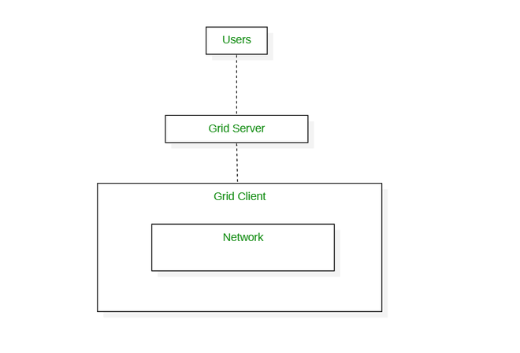

# 人工智能的基石：算力、计算范式和计算设施

支撑人工智能发展的三个要素包括：数据、算法、算力。可以说，数据是机器学习的输入，算法决定机器学什么、怎样学，算力加速学习过程。这里的算力并不只是显卡，为了又好又快又便宜又安全的计算，人们想尽办法从软件硬件各个层面提升计算能力。从算力、计算方式和计算设施三个方面看，相关概念如图。

## 1 定义

算力（Computing Power）：算力是通过计算设备对信息或数据进行处理，然后输出目标结果的计算能力。当我们谈论算力时，通常是指算力的基本载体即芯片，如CPU、GPU等。

计算（Computing）：计算是针对一个问题、设计出解决问题的指令序列，并由计算设备来执行的过程。计算机的出现就是为了解决计算问题。针对不同的计算问题，人们发明了各种计算范式，如并行计算、分布式计算等。

计算设施（Computing Infrastructure）：计算设施是计算设备的集合，包括硬件（如服务器、集群等）和软件（如操作系统、虚拟机等）。本文中主要指集群、超算和数据中心。

如果用一个人的学习过程来比喻，那么算力对应学习能力，芯片就是人的大脑；计算范式对应学习方法，使用不同学习方法可以提升学习效果；计算设施就是学校，提供硬件（如教室、图书馆等）和软件（如老师、班级等）。

## 2 算力

芯片是算力的基本载体，由半导体（硅）和集成电路组成。常见的芯片类型有CPU，GPU，FPGA，ASIC，它们的特点如下图所示。

| 芯片种类 | 定制化程度 | 可编辑性 | 计算能力 | 价格 | 应用                                               | 主要供应商及其产品                               |
| -------- | ---------- | -------- | -------- | ---- | -------------------------------------------------- | ------------------------------------------------ |
| CPU      | 通用       | 不可编辑 | 低       | 低   | 通用                                               | Intel (奔腾、酷睿系列)、AMD (锐龙系列)           |
| GPU      | 通用       | 不可编辑 | 中       | 中   | 深度学习、游戏、图形设计等                         | NVIDIA (Tesla、RTX Titan系列)、AMD（锐龙RX系列） |
| FPGA     | 半定制     | 可以编辑 | 高       | 高   | 各种行业，如网络通信、工业控制、消费电子和数据中心 | AMD (Xilinx)、英特尔(Altera)、Lattice、Microsemi |
| ASIC     | 全定制     | 难以编辑 | 高       | 低   | 定制化需求，如比特币挖矿                           | Intel、Infineon 等等[4]                          |

### 2.1 CPU

CPU就是笔记本电脑的中央处理器。1971年，Intel公司的工程师发明了世界上第一个商用微处理器，由此开启了计算机和互联网革命，Intel也伴随着互联网的第一个黄金时代起飞。由于芯片的材料主要是硅这种半导体，硅谷也因此得名。Intel创始人摩尔提出著名的摩尔定律：当价格不变时，集成电路上可容纳的元器件的数目，约每隔18-24个月便会增加一倍，性能也将提升一倍。然而，随着芯片组件的规模越来越接近单个原子的规模，摩尔定律已逐渐失效，半导体行业发展逐渐放缓，该行业正采用其他计算方式（如GPU）、先进软件架构和工具，以及新的芯片电路封装方法来提升整体计算性能。

### 2.2 GPU

GPU即图形处理器，又称显卡，负责输出显示图形。由于GPU有大量的核心和高速内存，擅长并行计算，因此被用来处理需要大量矩阵运算的深度学习任务。主流显卡的显示芯片主要由NVIDIA（英伟达）和AMD两大厂商制造，通常NVIDIA的显卡称为N卡，AMD的显卡称为A卡。主流深度学习所用的显卡主要是N卡，因为深度学习要用到CUDA加速。CUDA是NVIDIA推出的GPU并行计算框架，只能在自家GPU上运行，并且几乎所有深度学习框架都首选CUDA作为底层加速库。深受广大AI炼丹师喜爱的显卡有GTX1080Ti、GTX3080Ti、Tesla V100、Tesla A100等。

### 2.3 FPGA

FPGA是可编程集成电路，FPGA内部的电路旨在实现各种不同的功能，并且可以根据需要重新编程以执行这些功能。FPGA可以在制造后由用户编程用于特定用途。FPGA包含通过可编程互连连接的自适应逻辑模块 (ALM) 和逻辑元件(LE)。这些块创建了逻辑门的物理阵列，可以定制以执行特定的计算任务。目前全球FPGA市场由四大巨头AMD（Xilinx）、英特尔、Lattice、Microsemi垄断，四大厂商的市场占有率达到了96%。FPGA作为产业新动能的强大引擎对“新基建”的核心领域5G、物联网、数据中心等都起到非常重要的作用。

### 2.4 ASIC

ASIC属于专用集成电路，是为特定功能而专门构建和批量生产的。与 FPGA 不同，它们不能重新编程，但ASIC具有体积更小、重量更轻、功耗更低、可靠性提高、性能提高、保密性增强、成本降低等优点。以前，人们都是用PC（x86通用芯片）挖矿，后来越挖难度越大，算力不够。于是，开始使用显卡（GPU）去挖矿。再后来，显卡的能耗太高，挖出来的币值还抵不上电费，就开始采用FPGA和ASIC集群阵列挖矿[1]。 

## 3 计算范式

### 3.1 并行计算

并行计算被定义为一种同时使用多个计算机系统的计算类型。在这里，一个问题被分解成子问题，然后进一步分解成指令。每个子问题的这些指令在不同的处理器上同时执行。在下图中，你可以看到并行计算系统是如何由多个处理器组成的，这些处理器相互通信并同时在共享内存上执行多个任务。并行计算的目的是为了节省时间和提供并发性。

### 3.2 分布式计算

分布式计算被定义为一种计算类型，其中多个计算机系统对一个问题进行工作。在这里，所有的计算机系统被连接在一起，问题被分为子问题，每个部分由不同的计算机系统来解决。分布式计算的目标是提高系统的性能和效率，确保容错。在下图中，每个处理器都有自己的本地存储器，所有处理器通过网络相互通信。

#### 3.2.1 网格计算

网格计算是由计算机组成的网络，共同执行单台机器可能难以处理的任务。该网络上的所有计算机都在同一个保护伞下工作，被称为虚拟超级计算机。他们工作的任务要么是高计算能力，要么是由大型数据集组成。网格计算中计算机系统之间的所有通信都是在 "数据网格 "上完成的。网格计算的目标是在更短的时间内解决更多的高计算问题，提高生产力。

#### 3.2.2 云计算

云被定义为使用别人的服务器来托管、处理或存储数据。云计算被定义为一种计算类型，它是在互联网上以随用随付的方式提供按需计算服务。

#### 3.2.3 边缘计算

边缘计算被定义为专注于减少客户端和服务器之间长距离通信的计算类型。这是通过在云中运行较少的进程，并将这些进程转移到用户的计算机、物联网设备或边缘设备/服务器上。

### 3.3 集群计算

集群是一组独立的计算机，它们一起工作以执行给定的任务。集群计算被定义为一种计算类型，由两台或更多的独立计算机组成，被称为节点，作为一台机器一起工作执行任务。集群计算的目标是提高系统的性能、可扩展性和简单性。正如下图中看到的，所有的节点，（无论它们是父节点还是子节点），都作为一个单一的实体来执行任务。

### 3.4 高性能计算

高性能计算研究集群架构、并行算法和相关软件基础，通过分布式计算实现单台计算机无法达到的运算速度。高性能计算主要应用领域有： 

- 科学计算类：物理化学、气象环保、生命科学、石油勘探、天文探测等。 

- 工程计算类：计算机辅助工程、计算机辅助制造、电子设计自动化、电磁仿真等。 

- 智能计算类：即人工智能（AI，Artificial Intelligence）计算，包括：机器学习、深度学习、数据分析等。 

## 4 计算设施

计算设施（或基础计算设施），就如学校是教育设施、医院是医疗设施、铁路是交通设施一样，强调的是具体的物理形态。因此将计算设施分为集群、超算、数据中心。

### 4.1 集群

集群就是指一组（若干个）相互独立同时可以通过网络彼此互联的计算机，每个集群节点（即集群中的每台计算机）都是运行各自服务的独立服务器，这些服务器合作做同一件事。当用户请求集群系统时，集群给用户的感觉就是一个单一独立的服务器，而实际上用户请求的是一组集群服务器。

> 分布式与集群的区别是什么？引用一个例子说明[7]：小饭店原来只有一个厨师，切菜洗菜备料炒菜全干。后来客人多了，厨房一个厨师忙不过来，又请了个厨师，两个厨师都能炒一样的菜，这两个厨师的关系是**集群**。为了让厨师专心炒菜，把菜做到极致，又请了个配菜师负责切菜，备菜，备料，厨师和配菜师的关系是**分布式**。

### 4.2 超算

超算主要提供国家高科技领域和尖端技术研究需的运算速度和存储容量，包括航天、国防、石油勘探、气候建模和基因组测序等。

### 4.3 数据中心

数据中心主要面向需要信息技术服务的商业场景（云）。数据中心架构：

## 参考资料

[1] 《关于“算力”，这篇文章值得一看》 https://36kr.com/p/1848541284191362

[2] 邢文娟, 雷波, 赵倩颖. 算力基础设施发展现状与趋势展望[J]. 电信科学, 2022, 38(6): 51-61. http://www.infocomm-journal.com/dxkx/CN/10.11959/j.issn.1000-0801.2022137

[3] 《科普：并行计算、分布式计算、集群计算和云计算》 https://max2d.com/archives/976

[4] 《什么是ASIC？ASIC供应商有哪些？》https://mp.ofweek.com/ee/a356714038087

[5] Different Computing Paradigms https://www.geeksforgeeks.org/different-computing-paradigms/

[6] 《2022中国人工智能芯片行业研究报告》 https://pdf.dfcfw.com/pdf/H3_AP202204131558974968_1.pdf?1649846951000.pdf

[7] 分布式与集群的区别是什么？ - 张鹏飞的回答 - 知乎 https://www.zhihu.com/question/20004877/answer/112124929

[8] 数据中心定义、分类及产业链 https://blog.51cto.com/kymdidicom/3140009
