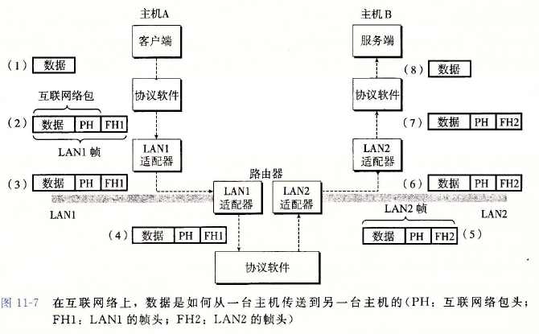
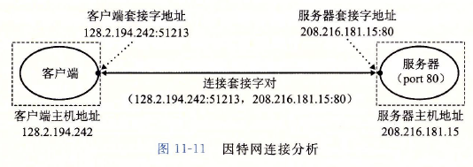

# CSAPP概念整理（一）

编译系统：预处理器、编译器、汇编器、链接器一起构成了编译系统。

GNU/Linux：GNU环境+Linux内核

系统的硬件组成：

- 总线：携带字节信息并负责在各个部件间传递。传送定长的字节块，也就是字，字节数即字长是一个基本的系统参数，大多数机器是4个字节（32位）或8个字节（64位）。
- I/O设备：键盘、鼠标、显示器、磁盘。每个I/O设备都通过一个控制器或适配器与I/O总线相连。
- 主存（内存）：主存是一个临时存储设备，由一组动态随机存取存储器（DRAM）芯片组成的。存储器是一个线性的字节数组，每个字节都有其唯一的地址（数组索引），组成程序的每条机器指令都由不同数量的字节构成。
- 处理器（CPU）：解释或执行存储在主存中的指令。处理器一直在不断地从PC指向的内存处读取指令，执行指令的操作，再更新PC，使其指向下一条指令。
  - 程序计数器（PC）：PC指向主存中某条机器语言指令（即含有该条指令的地址）。
  - 算术逻辑单元（ALU）：计算新的数据和地址值。
  - 寄存器文件（Register File）：负责存储。

指令集架构（ISA）：处理器按照一个指令执行模型来操作，这个模型由指令集架构决定。指令集架构描述的是每条机器代码指令的效果；而微体系结构描述的是处理器实际上如何实现。

cache：高速缓存存储器（cache memory）。

SRAM：静态随机访问存储器。

存储器层次结构：

- L0：寄存器。CPU寄存器保存来自高速缓存的字。
- L1：L1高速缓存（SRAM）。L1高速缓存保存取自L2高速缓存的高速缓存行。
- L2：L2高速缓存（SRAM）。L2高速缓存保存取自L3高速缓存的高速缓存行。
- L3：L3高速缓存（SRAM）。L3高速缓存保存取自主存的高速缓存行。
- L4：主存（DRAM）。主存保存取自本地磁盘的磁盘块。
- L5：本地二级存储（本地磁盘）。本地磁盘保存取自远程网络服务器上磁盘的文件。
- L6：远程二级存储（分布式文件系统、web服务器）。

操作系统：应用程序（软件）和硬件之间的一层软件，所有应用程序对硬件的操作都必须通过操作系统。操作系统通过几个抽象的基本概念（进程、虚拟内存、文件）来实现。

- 文件是I/O设备的抽象。
- 虚拟内存是主存和I/O设备的抽象。
- 进程是处理器、主存和I/O设备的抽象。

进程（Process）：进程是操作系统对一个正在运行的程序的一种抽象。

- 并发（Concurrency）：一个进程的指令和另一个进程的指令交错执行。
- 上下文切换（Context Switch）：这种交错执行的机制成为上下文切换。当操作系统决定把控制权从当前进程转移到某个新进程时，就会上下文切换，即保持当前进程的上下文，恢复新进程的上下文，将控制权传递给新进程。
- 上下文：操作系统保持跟踪进程运行所需的所有状态信息。
- 内核：从一个进程到另一个进程的转换是由操作系统内核管理的。内核是操作系统常驻主存的部分。当应用程序需要操作系统的某些操作时，它就执行一条系统调用指令，将控制权传递给内核，然后内核执行请求的操作并返回应用程序。内核不是一个独立的进程，而是系统管理全部进程所用代码和数据结构的集合。
- 线程（Thread）：一个进程实际上可以由多个成为线程的执行单元组成，每个线程都运行在进程的上下文中，共享同样的代码和全局数据。

虚拟内存：为每个进程提供一个假象，即每个进程都在独占使用主存。每个进程看到的内存都是一致的，成为虚拟地址空间。每个进程看到的虚拟地址空间由大量准确定义的区构成，每个区由专门的功能。    

文件：文件就是字节序列。

网络：现代系统通过网络与其他系统连接到一起，是计算机系统之间通信的手段。网络可以视为一个I/O设备，系统从网络适配器发送和读取其他机器的数据。

并发和并行：并发是一个通用概念，指一个同时具有多个活动的系统，并发可以使系统同时做更更多事情（一方面做得更多，一方面运行得更快。）；而并行（parallelism）指的是用并发来使一个系统运行地更快。并行可以在计算机系统的多个抽象层次上运用：

- 线程级并发：
  - 单核处理器：并发是模拟出来的，只是通过进程间的快速切换实现。
  - 多核处理器：将多个CPU集成在一个集成电路芯片上。
  - 超线程/同时多线程：常规处理器需要大约20000个时钟周期做线程间切换，而超线程的处理器可以在单个周期的基础上决定线程切换。这必须要求程序是以多线程方式来书写的。
- 指令级并行：
  - 现代处理器可以同时执行多条指令的属性称为指令级并行。
  - 流水线（pipelining）：在流水线中，将执行一条指令所需要的活动划分成不同的步骤，将处理器的硬件组织成一系列的阶段，每个阶段执行一个步骤，这些阶段可以并行操作，用来处理不同指令的不同部分。
  - 超标量（superscalar）：如果处理器可以达到比一个周期一条指令更快的执行速率，就称之为超标量处理器。
- 单指令 、多数据并行：
  - 许多现代处理器拥有特殊的硬件，允许一条指令产生多个可以并行执行的操作，称为单指令、多数据，即SIMD并行。

虚拟机：对整个计算机的抽象，包括操作系统、处理器和程序。

指令集体系结构（ISA）：指令被编码为由一个或多个字节序列组成的二进制格式。一个处理器支持的指令和指令的字节级编码称为它的指令集体系结构。ISA在编译器编写者和处理器设计人员之间提供了一个概念抽象层，编译器编写者只需要知道允许哪些指令以及它们是如何编码的；而处理器设计者必须建造出执行这些指令的处理器。

HCL（硬件控制语言）：用来描述处理器的设计。

流水线化的处理器：将每条指令的执行分成5步，每个步骤由一个独立的硬件或阶段来处理。处理器可以同时执行5条指令的不同阶段。

冒险或冲突：冒险就是一条指令的位置或操作位数依赖于其他仍在流水线中的指令。

虚拟地址：引用内存位置，硬件和操作系统联合起来将虚拟地址翻译成实际或物理地址。

指令的不同的阶段：

- 取指（fetch）：取址阶段从内存读取指令字节，地址为程序计数器的值。
- 译码（decode）：译码阶段从寄存器文件读入最多两个操作数。
- 执行（execute）：算术逻辑单元要么执行指令指明的操作，计算内存引用的有效地址，要么增加或者减少栈指针。
- 访存（memory）：访存阶段可以将数据写入内存，或者从内存读出数据。
- 写回（write back）：写回阶段最多可以写两个结果到寄存器文件。
- 更新PC：将PC设置成下一条指令的地址。

吞吐量和延迟：流水线的一个重要特性就是提高了系统的吞吐量（throughput），也就是单位时间内执行的指令总数，不过也会轻微增加延迟（latency），也就是执行一个指令所需要的时间。我们以每秒千兆条指令（GIPS），也就是每秒十亿条指令，为单位来描述吞吐量。从头到尾执行一条指令所需要的时间称为延迟（latency）。

程序剖析（profiling）运行程序的一个版本，其中插入了工具代码，以确定程序的各个部分需要多少时间。剖析的一个有利之处在于可以在现实的基准数据（benchmark data）上运行实际程序的同时，进行剖析。

# CSAPP概念整理（二）

存储器系统（memeory system）：存储器系统是一个具有不同容量、成本和访问时间的存储设备的层次结构。

局部性（locality）：具有良好局部性的程序倾向于访问相同或是邻近的数据项集合。具有良好局部性的程序比局部性差的程序更多倾向于从存储器层次结构中较高层次处访问数据项，因此运行地更快。

- 时间局部性：在一个具有良好时间局部性的程序中，被引用过一次的内存位置很可能在不远的将来再被多次引用。
- 空间局部性：在一个具有良好空间局部性的程序中，如果一个内存位置被引用了一次，那么程序很可能在不远的将来引用附近的一个内存位置。

随机访问存储器（RAM）：

- 静态RAM（SRAM）：用来作为高速缓存存储器
- 动态RAM（DRAM）：用来作为主存以及图形系统的帧缓冲区

非易失性存储器（Nonvolatile memory，NVM）：如果断电，SRAM和DRAM会丢失它们的信息，它们是易失的。非易失性存储器关电后仍然保持信息，包括只读存储器（ROM）。

- PROM：只能被编程一次
- EPROM：可编程100次
- EEPROM：可编程$10^5$次
- 闪存：基于EEPROM
- 固态硬盘（SSD）：基于闪存的磁盘驱动器

存储器层次结构的中心思想是：对于每个k，位于k层的更快更小的存储设备作为位于k+1层的更大更慢的存储设备的缓存。第k+1层的存储器被划分成连续的数据对象组块（block），每个块都有一个唯一的地址或名字。数据总是以块大小为传送单元在第k层和k+1层之间来回复制的。

缓存命中（cache hit）：当程序需要第k+1层的某个数据对象d时，它首先在当前存储在第k层的一个块中查找d。如果d刚好缓存在第k层中，那么就是我们所说的缓存命中。

链接（linking）：链接是将各种代码和数据片段收集并组合成一个单一文件的过程，这个文件可以被加载到内存并执行。链接可以执行于编译时、加载时、运行时，使得分离编译成为可能。

控制流（control flow）：程序计数器假设一个值的序列$a_0, a_1, ..., a_{n-1}$，其中，$a_k$是某个相应的指令$I_k$的地址。每次从$a_k$到$a_{k+1}$的过渡称为控制转移。这样的控制转移序列叫做处理器的控制流。

异常控制流：现代系统通过使控制流发生突变来对系统状态的变化做出反应。状态变化称为事件（event）。

异常表：当处理器检测到有事件发生时，它就会通过一张叫做异常表的跳转表，进行一个间接过程调用，到一个专门设计用来处理这类事件的操作系统子程序（异常处理程序）。

进程（Process）：异常是允许操作系统内核提供进程概念的基本构造块。进程提供给应用程序的关键抽象：

- 一个独立的逻辑控制流，提供独占处理器的假象
- 一个私有的地址空间，提供独占内存系统的假象

逻辑控制流：程序计数器中的指令序列。进程是轮流使用处理器的，每个进程执行它的流的一部分，然后被抢占（暂时挂起），然后轮到其他进程。

并发流：一个逻辑流的执行在时间上与另一个重叠，称为并发流，这两个流被称为并发（concurrency）的运行。

多任务：一个进程和其他进程轮流运行的概念称为多任务（multitasking）。一个进程执行它的控制流的一部分的每一时间段叫时间片（time slice），因此多任务也叫时间分片（time slicing）。

并行：如果两个流并发地运行在不同的处理器核或者计算机上，那么我们称它们为并行流（parallel flow），它们并行地运行（runnning in parallel）。

上下文切换（context switch）：操作系统内核使用一种称为上下文切换的较高层形式的异常控制流来实现多任务。内核为每个进程维持一个上下文。

调度（scheduling）：在进程执行的某些时刻，内核可以决定抢占当前进程，并重新开始一个先前被抢占了的进程。这种决策就叫做调度（scheduling），在内核中由调度器（scheduler）实现。

虚拟内存（VM）：为了更加有效地管理内存并少出错，现代系统提供了一种对主存的抽象概念，叫做虚拟内存（VM）。

物理寻址：计算机系统的主存被组织成一个由M个连续的字节大小单元组成的数组，每字节都有一个唯一的物理地址（physical address），CPU访问内存最自然的方式就是物理寻址（phsical addressing）。

虚拟寻址：CPU通过生成一个虚拟地址（virtual address）来访问主存，这个虚拟地址在被送到内存之前先转换成适当的物理地址。将虚拟地址转换为物理地址称为地址翻译。

地址空间：地址空间是一个非负数地址的有序集合。

虚拟页（virtual page，VP）：VM系统通过将虚拟内存分割为称为虚拟页的大小固定的块来处理。

动态内存分配：动态内存分配维护着一个进程的虚拟内存区域，称为堆（heap）。分配器将堆视为一组不同大小的块来维护。分配器有两种风格：

- 显式分配器。要求应用显式地释放任何已分配的块。例如，C语言的malloc。
- 隐式分配器。要求分配器检测一个已分配块何时不再程序所使用，那么就释放这个块。隐式分配器也叫垃圾收集器（garbage collector），而自动释放未使用的已分配块的过程叫做垃圾收集（garbage collection）。例如，Java之类的高级语言就依赖垃圾收集来释放已分配块。

# CSAPP概念整理（三）

输入/输出（I/O）：I/O是在主存和外部设备（例如磁盘驱动器、终端和网络）之间复制数据的过程。输入操作是从I/O设备复制数据到主存，而输出操作是从主存复制数据到I/O设备。

客户端-服务器模型：每个网络应用都是基于客户端-服务器模型的。一个应用是由一个服务器进程和一个或者多个客户端进程组成。

事务（Transaction）：客户端-服务器模型中的基本操作是事务。一个事务由以下4步组成：

- 1）当一个客户端需要服务时，它向服务器发送一个请求，发起一个事务。
- 2）服务器收到请求后，解释它，并以适当的方式操作它的资源。
- 3）服务器给客户端发送一个响应，并等待下一个请求。
- 4）客户端收到响应并处理它。

网络：对主机而言，网络只是一种I/O设备，是数据源和数据接收方。

协议：解决主机之间的通信问题，通过控制主机和路由器协同工作来实现数据传输。

- 命名机制。定义一种一致的主机地址格式。
- 传送机制。定义一种把数据位捆扎成包的统一方式。一个包由包头和有效载荷组成。其中包头包括包的大小以及源主机和目的主机的地址，有效载荷包括从源主机发出的数据位。

因特网：

- 主机被映射为一组32位的IP地址
- 这组IP地址被映射为一组称为因特网域名的标识符
- 因特网主机上的进程能够通过连接（connection）和任何其他因特网主机上的进程通信

端口：

Web服务器：

- Web客户端和服务器之间的交互用的是HTTP
- Web可以用一种叫做HTML的语言来编写

Web服务器以两种不同的方式向客户端提供内容：

- 取一个磁盘文件，并将它的内容返回给客户端。磁盘文件称为静态内容，而返回文件给客户端的过程称为服务静态内容。
- 运行一个可执行文件，并将它的输出返回给客户端。运行时可执行文件的输出称为动态内容，而运行程序返回它的输出到客户端的过程称为服务动态内容。

应用级并发：

- 访问慢速I/O设备
- 与人交互
- 通过推迟工作以降低延迟
- 服务多个网络客户端
- 在多核机器上进行并行计算

并发程序：使用应用级并发的应用程序称为并发程序，现代操作系统提供了三种基本的构造并发程序的方法：

- 进程
- I/O多路复用
- 线程

