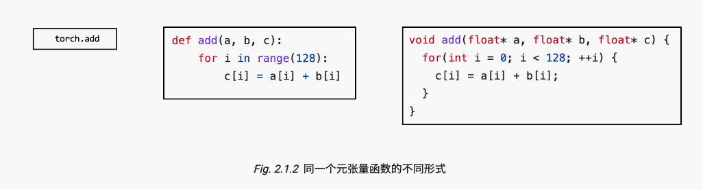

# 02 张量程序抽象

参考资料

- 英文课程主页 https://mlc.ai/summer22/ 英文课程材料 https://mlc.ai/index.html

- 中文课程主页 https://mlc.ai/summer22-zh/ 中文课程材料 https://mlc.ai/zh/index.html

---

## 元张量函数

> 机器学习编译的过程可以被看作张量函数之间的变换。一个典型的机器学习模型的执行包含许多步将输入张量之间转化为最终预测的计算步骤，其中的每一步都被称为元张量函数 (primitive tensor function)。

张量算子 linear, add, relu 和 softmax 均为元张量函数。

许多不同的抽象能够表示（和实现）同样的元张量函数（正如下图所示）。

许多机器学习框架都提供机器学习模型的编译过程，以将元张量函数变换为更加专门的、针对特定工作和部署环境的函数。

## 张量程序抽象

通常来说，一个典型的元张量函数实现的抽象包含了一下成分：存储数据的多维数组（Multi-dimensional buffers），驱动张量计算的循环嵌套（Loop nests）以及计算部分本身的语句（Computions）。

张量程序是一个表示元张量函数的有效抽象。

- 关键成分包括: 多维数组，循环嵌套，计算语句。

- 程序变换可以被用于加速张量程序的执行。

- 张量程序中额外的结构能够为程序变换提供更多的信息。

