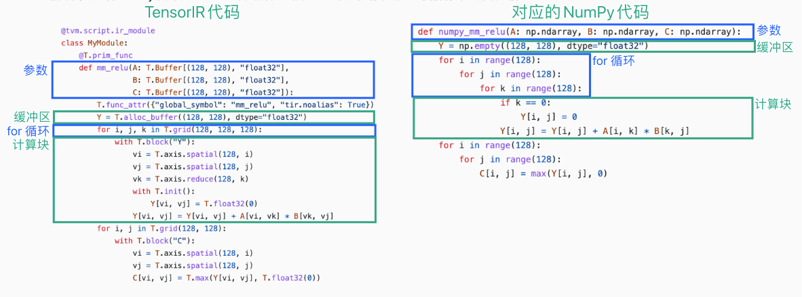

# 03 张量程序抽象案例研究：TensorIR

TensorIR 是标准机器学习编译框架 Apache TVM 中使用的张量程序抽象。

> 使用张量程序抽象的主要目的是表示循环和相关的硬件加速选择，如多线程、特殊硬件指令的使用和内存访问。

## 张量函数抽象 - TensorIR实例

对于两个大小为$128×128$的矩阵 A 和 B，进行如下两步的张量计算：一个线性层（矩阵乘法）与一个 ReLU 激活层。
$$
Y_{i,j} = \sum_k{A_{i,k}×{B_{k,j}}}
$$

$$
C_{i,j} = relu(Y_{i,j}) = max(Y_{i,j},0)
$$

### NumPy表示

```python
dtype = "float32"
a_np = np.random.rand(128, 128).astype(dtype)
b_np = np.random.rand(128, 128).astype(dtype)
# a @ b is equivalent to np.matmul(a, b)
c_mm_relu = np.maximum(a_np @ b_np, 0)
```

### NumPy实现mm_relu

```python
def lnumpy_mm_relu(A: np.ndarray, B: np.ndarray, C: np.ndarray):
    Y = np.empty((128, 128), dtype="float32")
    for i in range(128):
        for j in range(128):
            for k in range(128):
                if k == 0:
                    Y[i, j] = 0
                Y[i, j] = Y[i, j] + A[i, k] * B[k, j]
    for i in range(128):
        for j in range(128):
            C[i, j] = max(Y[i, j], 0)
```

### TensorIR 实现mm_relu

下面的代码块展示了 `mm_relu` 的 TensorIR 实现。这里的代码是用一种名为 **TVMScript** 的语言实现的，它是一种嵌入在 Python AST 中的特定领域方言。

```python
@tvm.script.ir_module
class MyModule:
    @T.prim_func
    def mm_relu(A: T.Buffer[(128, 128), "float32"],
                B: T.Buffer[(128, 128), "float32"],
                C: T.Buffer[(128, 128), "float32"]):
        T.func_attr({"global_symbol": "mm_relu", "tir.noalias": True})
        Y = T.alloc_buffer((128, 128), dtype="float32")
        for i, j, k in T.grid(128, 128, 128):
            with T.block("Y"):
                vi = T.axis.spatial(128, i)
                vj = T.axis.spatial(128, j)
                vk = T.axis.reduce(128, k)
                with T.init():
                    Y[vi, vj] = T.float32(0)
                Y[vi, vj] = Y[vi, vj] + A[vi, vk] * B[vk, vj]
        for i, j in T.grid(128, 128):
            with T.block("C"):
                vi = T.axis.spatial(128, i)
                vj = T.axis.spatial(128, j)
                C[vi, vj] = T.max(Y[vi, vj], T.float32(0))
```

### TensorIR和NumPy代码对应⭐



### 块和块轴（Block axis）

**TensorIR 包含一个名为 `T.block` 的额外结构。块** 是 TensorIR 中的基本计算单位。一个块包含一组块轴（`vi、vj、vk`）和围绕它们定义的计算。

```python
vi = T.axis.spatial(128, i)
vj = T.axis.spatial(128, j)
vk = T.axis.reduce(128, k)
```

上面三行声明了关于块轴的**关键性质**，语法如下。

```python
[block_axis] = T.axis.[axis_type]([axis_range], [mapped_value])
```

这三行包含以下信息：

- 定义了 `vi`、`vj`、`vk` 应被绑定到的位置（在本例中为 `i`、`j` 和 `k`）；
- 声明了 `vi`、`vj`、`vk` 的原始范围（`T.axis.spatial(128, i)` 中的 `128`）；
- 声明了块轴的属性（`spatial`, `reduce`）。

轴属性标记了轴与正在执行的计算之间的关系。 


块 `Y` 通过读取来自 `A[vi, vk]` 和 `B[vk, vj]` 的值来计算结果 `Y[vi, vj]`，并对所有可能的 `vk` 执行求和。 在这个特定示例中，如果我们将 `vi`、`vj` 固定为 `(0, 1)`，并对 `vk in range(0, 128)` 执行块 `Y`，我们可以独立于其他可能的位置（具有不同 `vi`, `vj` 值的位置）有效地计算 `C[0, 1]`。我们可以称 `vi`、`vj` 为**空间轴**，涉及归约（`vk`）的轴被命名为**归约轴**。

### 函数属性和装饰器

函数属性信息包含关于函数的额外信息。

```python
T.func_attr({"global_symbol": "mm_relu", "tir.noalias": True})
```

`@tvm.script.ir_module` 和 `@T.prim_func` 这两个装饰器用于表示对应部分的类型。

`@tvm.script.ir_module` 表示 `MyModule` 是一个 IRModule。IRModule 是在机器学习编译中保存张量函数集合的容器对象。

### 小结

到目前为止，我们一同看过了一个 TensorIR 程序示例，并涵盖了大部分元素，包括：

- 参数和中间临时内存中的缓冲区声明；
- For 循环迭代；
- **块**和块轴属性。

## 张量函数变换

