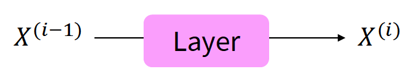
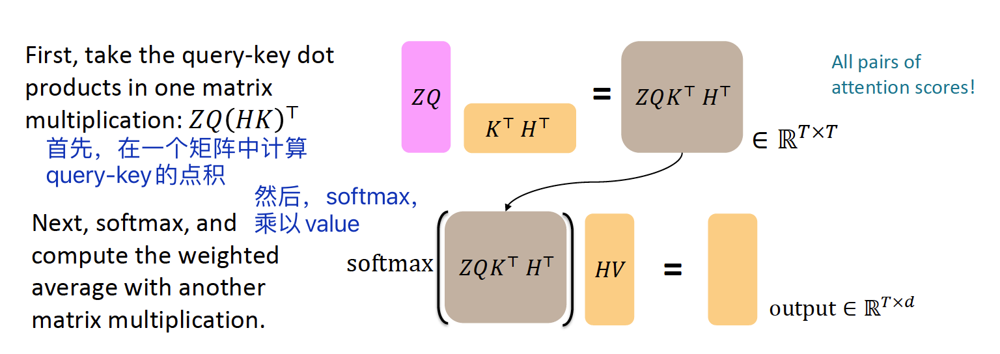

# Lecture09: 自注意力模型、Transformers

## 本节主要内容

- 从RNN到基于注意力的NLP模型
- Transformer模型

## 1 从RNN到基于注意力的NLP模型

### 1.1 RNN模型存在的问题
1. 线性相互作用距离（Linear interaction distance），即长距离依赖问题。
2. 缺少并行性（parallelizability）。

为了解决上述问题，人们考虑到了注意力机制。

> *[学生提问]注意力和全连接网络的区别是什么？*
>
> *1.注意力的权重是动态的*
>
> *2.参数的计算不同*

### 1.2 自注意力模型介绍

注意力机制的运作需要queris, keys, values向量：

- **queries**  $q_1, q_2,..., q_T$，$q_i∈R^d$
- **keys**  $k_1, k_2,..., k_T$，$k_i∈R^d$
- **values**  $v_1, v_2,..., v_T$，$v_i∈R^d$

在自注意力模型（self-attention）中，queries，keys，values来源相同。

- 例如，如果某层的输出是$x_1, x_2,..., x_T$，那么可以使$v_i = k_i = q_i = x_i$[?]

那么，自注意力的计算（以点积为例）如下：

（1）计算query-key乘积，得到注意力分数$e_{ij}$
$$
e_{ij} = q_i^Tk_j
$$
（2）计算注意力权重$α$
$$
α_{ij} = softmax(e_{ij})
$$
（3）计算输出
$$
output_i = \sum_j{α_{ij}v_j}
$$

### 1.3 自注意力模块的处理

#### 1.3.1 位置编码
因为自注意力没有考虑位置信息，所以需要将序列的位置编码到keys，queries，values向量中。

考虑将序列索引（sequence index）用向量（vector）表示：
$$
p_i∈R^d, for\; i∈{1,2,...,T}
$$
$p_i$即位置向量（positional vector）。

得到位置向量后，我们将其加到输入里。假设$\widetilde q$，$\widetilde k$，$\widetilde v$是之前的向量，则：
$$
q_i =\widetilde q_i + p_i\\
k_i =\widetilde k_i + p_i\\
v_i =\widetilde v_i + p_i\\
$$

> *[?]位置向量不是加到输入里吗？为什么这里是加入到q,k,v？*

位置向量有多种计算方式，如正弦位置表示等，最常用的是绝对位置表示（absolute position representations）。（注：有点像独热编码）

#### 1.3.2 遮罩

进行序列预测的时候，不能看到后面的信息，因此采用了遮罩（Masking）处理，即将后面单词的注意力分数设置为$-\infty$：

$$
e_{ij} = \left\{
\begin{aligned}
q^T_ik_j, j<i\\
-\infty, j≥i
\end{aligned}
\right.
$$

## 2 Transformer模型介绍

### 2.1 Transformer概览

### 2.2 Transformer编码器

编码器（Encoder）包含以下模块：

- Q-K-V向量

- 多头注意力机制（Multi-head attention）

其他训练技巧（这些技巧不能提升模型能做什么，而是加速训练过程）

- 残差连接（Residual connections）
- 归一化（Layer normalization）
- 缩放点积运算（Scaled Dot Product）

#### 2.2.1 Query-Key-Value向量矩阵

用$x_1,...,x_T$ $(x_i∈R^d)$表示Transformer编码器的输入向量，则queries, keys, values的计算如下：

- $q_i=Qx_i$，$Q∈R^{d×d}$是权重矩阵
- $k_i=Kx_i$，$K∈R^{d×d}$是权重矩阵
- $v_i=Vx_i$，$V∈R^{d×d}$是权重矩阵

对不同的参数矩阵对原始输入向量做线性变换，从而让不同的变换结果承担不同角色。

让我们通过矩阵的视角来看Q，K，V是如何计算的：

首先，用$X=[x_1;...;x_T]∈R^{T×d}$表示输入向量的拼接矩阵，那么$XQ∈R^{T×d}$，$XK∈R^{T×d}$，$XV∈R^{T×d}$。输出就可以表示为：
$$
output = softmax(XQ(XK)^T)×XV
$$

#### 2.2.2 多头注意力机制

对于单词$i$，自注意力只注意到$x^T_iQ^TKx_j$高的地方，但是我们如何关注到不同的$j$呢？

> *这里对为什么要使用多头的解释并不清楚，可以参考：为什么Transformer 需要进行 Multi-head Attention？ - 知乎 https://www.zhihu.com/question/341222779*
>
> *《自然语言处理——基于预训练模型的方法》P93中的解释是：*
>
> *“由于自注意力结果需要经过归一化，导致即使一个输入和多个其他的输入相关，也无法同时为这些输入赋予较大的注意力值，即自注意力结果之间是互斥的，无法同时关注多个输入。因此，如果能使用多组注意力模型产生多组不同的注意力结果，则不同组注意力模型可能关注到不同的输入上，从而增强模型的表达能力。“*

我们通过多个$Q, K, V$矩阵定义多头注意力（Multi-headed Attention）。

用$Q_ℓ,K_ℓ,V_ℓ∈R^{d×d/h}$ 表示不同的参数矩阵，其中$h$表示注意力头的序号，$ℓ$的取值范围是从$1$到$h$。*($R^{d×d/h}$)*

每个注意力头独立运算：
$$
output_ℓ = softmax(XQ_ℓK^T_ℓX^T)*XV_ℓ
$$
其中$output_ℓ∈R^{d/h}$。

然后，将所有的输出混合：
$$
output = Y[output_1;...;output_h],\ Y∈R^{d×d}
$$
下图是单头注意力和多头注意力的简单示意图：

可以看出，多头注意力和单个注意力的计算量是一样的。*（都是把矩阵拼起来计算一次）*

#### 2.2.3 残差连接

残差连接（Residual connections）是一种提升模型训练效果的技巧。

正常情况：$X^{(i)} = Layer(X^{(i-1)})$

残差连接：$X^{(i)} = X^{(i-1)}+Layer(X^{(i-1)})$

#### 2.2.4 归一化

归一化（Layer normalization）是一种提升模型训练速度的技巧。
$$
output = \frac{x-μ}{\sqrt{𝜎}+𝜖}*𝛾+𝛽
$$
其中，𝜇是均值，𝜎是标准差。𝛾和𝛽是gain和bias参数[?]。

#### 2.2.5 缩放点积运算

缩放点积运算是为了防止在维数过大时，梯度变小或消失。

正常情况：

$$
output_ℓ = softmax(XQ_ℓK_ℓ^TX^T)*XV_ℓ
$$

缩放点积运算：

$$
output_ℓ = softmax(\frac{XQ_ℓK_ℓ^TX^T}{\sqrt{d/h}})*XV_ℓ
$$

可以看出，就是将注意力分数除以维数$d$除以注意力头的数量$h$的根。

#### 2.2.6 小结

2.1中给出了Tranformer编码器的整体概览，经过对模块组成的分解，编码器更具体的结构如下图所示：

### 2.3 Transformer解码器

解码器的结构与编码器类似，如图：

可以看出，稍微不一样的地方在于交叉注意力（Cross attention）。

**交叉注意力机制**

假设$h_1,...,h_T$是Transformer编码器的输出向量，$z_1,...,z_T$是Transformer解码器的输入向量，那么，

- keys和values来自编码器：$k_i = Kh_i,v_i = Vh_i$
- queries来自解码器：$q_i=Qz_i$.

假设$H = [h_1;...;h_T]$是编码器向量的拼接，$Z = [z_1;...;z_T]$是解码器向量的拼接，那么输出可以定义为：
$$
output = softmax(ZQ(HK)^T)×HV
$$

