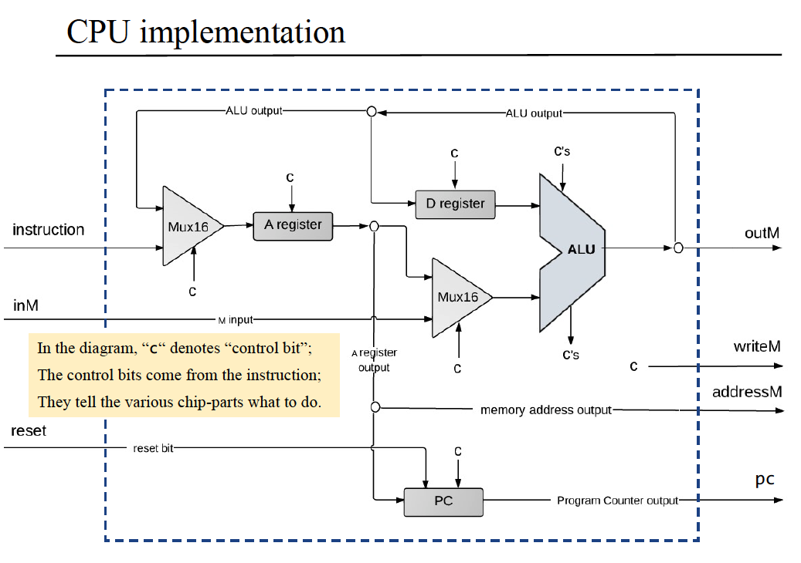

# Nand2Tetris Part1 (硬件)

## 介绍

课程官网：https://www.nand2tetris.org/

Nand2Tetris（全称《依据基本原理构建现代计算机：从与非门到俄罗斯方块》）分为两部分：硬件和软件。


硬件（PART1）的课程作业包括6个项目（其中P4和P6属于编程项目，其他都是硬件构建项目）：

- 项目1：构建初级逻辑门，如And, Or, Not, Multiplexor等
- 项目2：构建一个加法器（Full-Adder）芯片系列，最终构建一个算术逻辑单元（ALU）
- 项目3：构建寄存器（Register）和存储单元（Memory），最终构建一个随机存取存储器（RAM）
- 项目4：学习机器语言（Machine Langage）并使用它来编写一些说明性的低级程序（即汇编语言）
- 项目5：使用项目1-3中建立的芯片组，构建一个中央处理器（CPU）和一个硬件平台（Computer），能够执行项目4中介绍的机器语言编写的程序
- 项目6：开发一个汇编（Assembler）程序，把用符号机器语言编写的程序翻译成二进制可执行代码

硬件项目结构如图：


## 第1、2、3章 布尔逻辑、布尔运算、时序逻辑

第1-3章主要是介绍ALU和寄存器的原理和构建。


## 第4章 机器语言

### 机器语言、汇编

【机器语言】机器语言是计算机直接识别的**二进制代码**。机器语言是硬件和软件相接的中间线。

【符号表示】【助记符】程序员用符号指令表达的抽象思维被转换成执行在硅片上的物理操作。

【指令】【指令集】机器语言程序是一系列的**编码指令**。因为不同计算机在CPU的操作方式、寄存器数量和类型以及汇编语法上各不相同，所以有各自的语法，然而所有的机器语言都支持相似的**通用命令集合**。

【汇编语言/Assembly Language】【汇编编译器/Assembler】符号表示也成为汇编语言，将汇编程序翻译成二进制码的程序则称为汇编编译器。

### 内存访问命令、寻址方式、流程控制/分支

【内存访问命令】

1. 算术和逻辑命令：不仅允许操纵寄存器，而且还可以操纵特定的内存单元。
2. load和store命令：用来在寄存器和内存之间传递数据。

【寻址方式】

- 直接寻址/Direct Addressing：直接表示一个指定内存单元的地址。

  - LOAD R1, 67 // R1 ← Memory[67]
  - LOAD R1, bar //   R1 ← Memory[67] 假设bar指向内存地址67

- 立即寻址/Immediate Addressing：被用来加载常数，加载那些出现在指令代码里的数值，直接将数据装入寄存器，而不是将其当作内存单元的地址。

  - LOADI R1, 67 // R1 ← 67 将67加载到寄存器R1中

- 间接寻址/Indirect Addressing：地址没有直接出现在指令中，而是指定内存单元的内容代表地址。被用来处理指针。

  - （高级语言）x=foo[j] or x=*(foo+j) // foo是数组变量，x和j是整数变量；当数组foo在高级语言程序里被声明并初始化时，编译器分配一组连续的内存单元来保存这个数组数据，并用符号foo来指代该内存单元组的基地址（base address）；当编译器遇到foo[j]时，该地址相对于数组基地址的偏移量为j，所以在C中x=foo[j] or x=\*(foo+j)等价，\*n代表memory[n]。
  - （汇编语言）

    ADD R1, foo, j // R1 ← foo+j 将内存地址foo+j添加到R1中

    LOAD* R2, R1 // R2 ← Memory[R1] 将R1表示的内存地址中的值加载到R2中

    STR R2, x // x ← R2 将R2中的值用符号x表示

【控制流程】【分支】

- 反复：跳回到循环的初始位置
- 有条件执行：跳到前面的位置（如if-then）
- 子程序调用：跳到另一代码段的第一条命令
- 无条件跳转：直接跳转

### Hack Language规范和实现

【内存地址空间】内存中有两种不同的地址空间：指令地址空间和数据地址空间，简称指令内存和数据内存。CPU仅能执行存储在指令内存中的程序。

【寄存器】

- D：数据寄存器，储存数据值。
- A：既可以作为数据寄存器，也可以作为地址寄存器。储存【数值】或【数据内存中的地址】或【指令内存中的地址】。
- M: RAM

【@value】value可以是数值或是代表数值的符号，表示将特定的值存到A寄存器中。

#### A指令 - 地址指令


#### C指令 - 计算指令


dest = comp; jump

## 第5章 计算机体系结构

### 基本结构：冯诺依曼架构


### CPU电路图



### CPU抽象


### 计算机抽象


## 第6章 汇编编译器

```python
"""
input: Prog.asm (assembly code)
output: Prog.hack (binary code)
"""

def Parser(asmFile):
    with open(asmFile) as f:
        asmLines = f.readlines()
    parsedLines = []
    for line in asmLines:
        line = line.strip()
        if line:
            if not line.startswith("//"):
                if "//" in line:
                    line = line.split("//")[0]
                    line = line.strip()
                    parsedLines.append(line)
                else:
                    parsedLines.append(line)
    return parsedLines


def symbolTable(parsedLines):
    symbolTable = {
        "R0": "0000000000000000",
        "R1": "0000000000000001",
        "R2": "0000000000000010",
        "R3": "0000000000000011",
        "R4": "0000000000000100",
        "R5": "0000000000000101",
        "R6": "0000000000000110",
        "R7": "0000000000000111",
        "R8": "0000000000001000",
        "R9": "0000000000001001",
        "R10": "0000000000001010",
        "R11": "0000000000001011",
        "R12": "0000000000001100",
        "R13": "0000000000001101",
        "R14": "0000000000001110",
        "R15": "0000000000001111",
        "SP": "0000000000000000",
        "ARG": "0000000000000010",
        "LCL": "0000000000000001",
        "THIS": "0000000000000011",
        "THAT": "0000000000000100",
        "KBD": "0110000000000000",
        "SCREEN": "0100000000000000"
    }
    A_Instruction = lambda x: x.startswith('@')
    C_Instruction = lambda x: "=" in x or ";" in x
    L_Instruction = lambda x: x.startswith("(") and x.endswith(")")
    L_Value = lambda x: x.replace("(", "").replace(")", "").strip()

    lineNum = 0

    for line in parsedLines:
        if A_Instruction(line) or C_Instruction(line):
            lineNum += 1
        elif L_Instruction(line):
            binaryLineNum = bin(lineNum)[2:].zfill(16)
            symbolTable[L_Value(line)] = binaryLineNum
    
    baseAddress = 16
    for line in parsedLines:
        if A_Instruction:
            value = line[1:]
            if value not in symbolTable:
                valueBinary = bin(lineNum)[2:].zfill(16)
                symbolTable[value] = valueBinary
                baseAddress += 1
    
    return symbolTable


def Code(line, symbolTable):
    COMPUTATIONS = {
        "0": "0101010",
        "1": "0111111",
        "-1": "0111010",
        "D": "0001100",
        "A": "0110000",
        "!D": "0001101",
        "!A": "0110001",
        "-D": "0001111",
        "-A": "0110011",
        "D+1": "0011111",
        "A+1": "0110111",
        "D-1": "0001110",
        "A-1": "0110010",
        "D+A": "0000010",
        "D-A": "0010011",
        "A-D": "0000111",
        "D&A": "0000000",
        "D|A": "0010101",
        "M": "1110000",
        "!M": "1110001",
        "-M": "1110011",
        "M+1": "1110111",
        "M-1": "1110010",
        "D+M": "1000010",
        "D-M": "1010011",
        "M-D": "1000111",
        "D&M": "1000000",
        "D|M": "1010101"
    }
    DESTINATIONS = {
        "": "000",
        "M": "001",
        "D": "010",
        "MD": "011",
        "A": "100",
        "AM": "101",
        "AD": "110",
        "AMD": "111"
    }
    JUMPS = {
        "": "000",
        "JGT": "001",
        "JEQ": "010",
        "JGE": "011",
        "JLT": "100",
        "JNE": "101",
        "JLE": "110",
        "JMP": "111"
    }

    if line.startswith("(") and line.endswith(")"):
        return
    if line.startswith("@"):
        value = line[1:]
        if value in symbolTable:
            return symbolTable[value]
        valueBinary = bin(value)[2:].zfill(16)
        return valueBinary
    
    dest, jump = "", ""
    comp = line.split("=").pop().split(';')[0] # dest=comp;jump
    if "=" in line: 
        dest = line.split("=")[0]
    if ";" in line: 
        jump = line.split(";").pop()
    compBinary = COMPUTATIONS.get(comp, '0000000')
    destBinary = DESTINATIONS.get(dest, '000')
    jumpBinary = JUMPS.get(jump, '000')
    combinedBinaryCode = '111' + compBinary + destBinary + jumpBinary
    return combinedBinaryCode

if __name__ == "__main__":
    parsedLines = Parser("Max.asm")
    buildSymbolTable = symbolTable(parsedLines)
    generatedBinaryCode = [Code(line, buildSymbolTable) for line in parsedLines]
    hackLines = "\n".join([line for line in generatedBinaryCode if line])
    with open('Max.hack', "w") as f:
        f.write(hackLines)


```