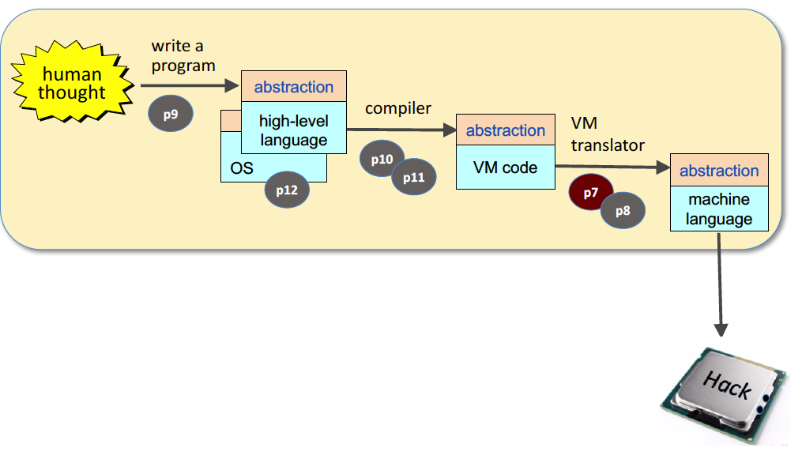
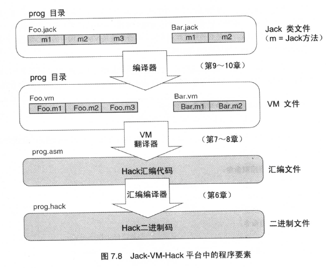
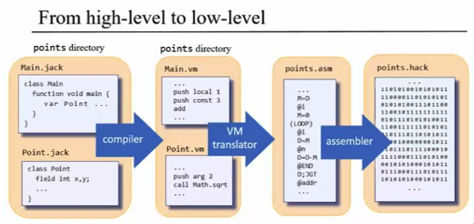

# Nand2Tetris Part1 (软件)

## 介绍

课程官网：https://www.nand2tetris.org/

Nand2Tetris（全称《依据基本原理构建现代计算机：从与非门到俄罗斯方块》）分为两部分：硬件和软件。软件部分如图：

软件（PART2）的课程作业包括6个项目：

- 项目7：构建虚拟机语言到汇编语言的翻译器（VM Translator），实现堆栈运算和内存访问
- 项目8：构建虚拟机语言到汇编语言的翻译器（VM Translator），实现程序控制和函数调用
- 项目9：用高级语言Jack编写程序
- 项目10：构建高级语言到虚拟机语言的编译器（Compiler），
- 项目11：构建高级语言到虚拟机语言的编译器（Compiler），
- 项目12：操作系统抽象

## 第7章、第8章 虚拟机

### 从高级编程语言到二进制代码：Jack→VM→Hack(ASM)→Hack(Binary)

## 第9章 高级语言

作者设计的高级语言Jack，语法和Java，C#类似。

## 第10章、第11章 编译器

## 第12章 操作系统

操作系统用来衔接计算机硬件和软件，主要作用包括：（1）封装不同的硬件服务（2）用不同的函数和数据类型扩展了高级语言。操作系统通常由高级语言编写，并被编译成二进制形式。