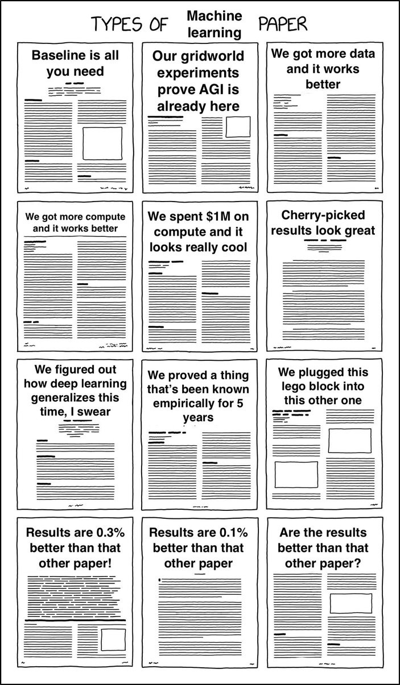
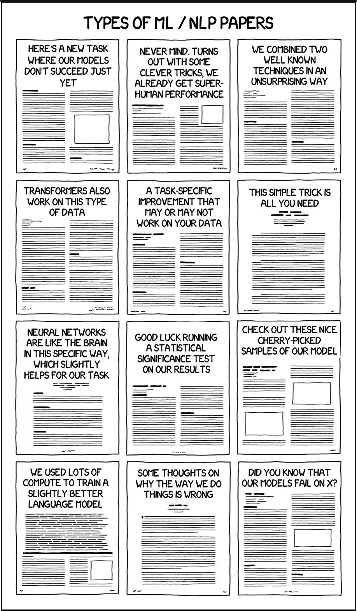
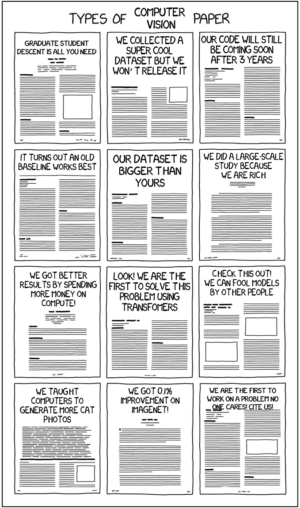
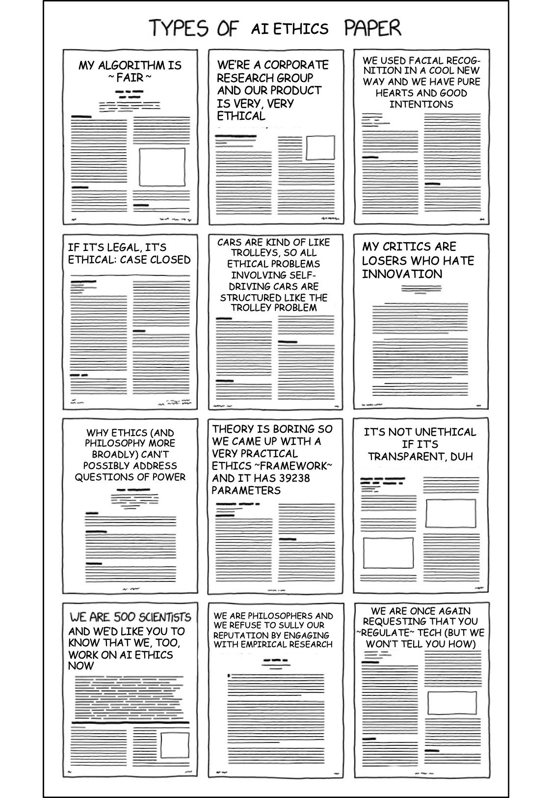
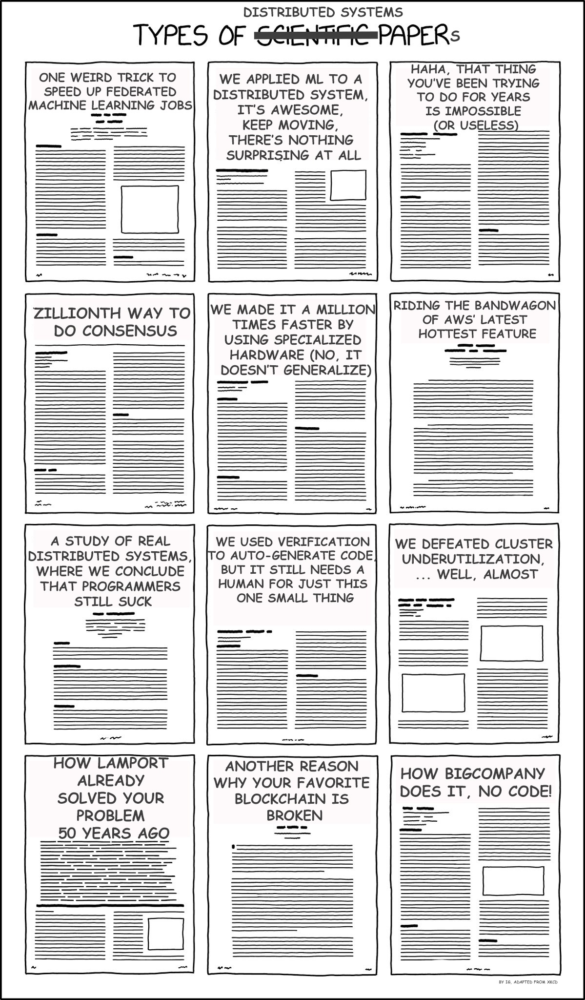
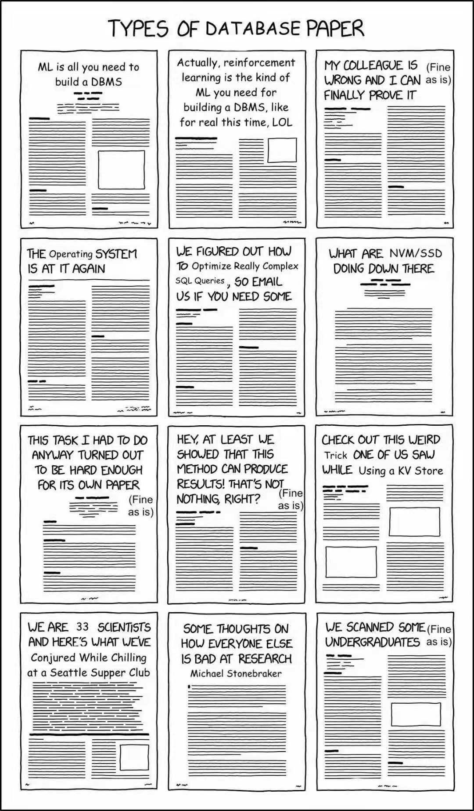
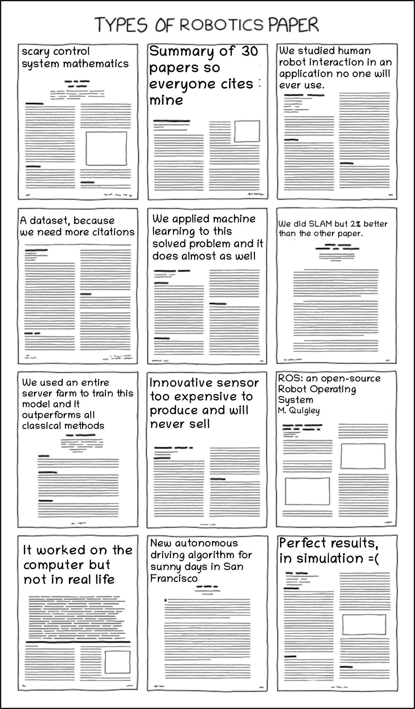
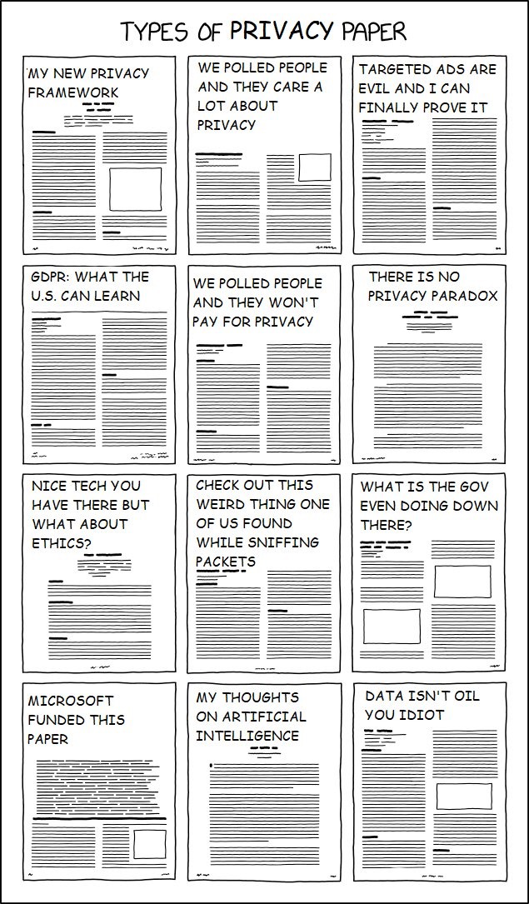

# Types of CS Paper

*from the Internet.*

## Types of Machine Learning Paper

## Types of NLP Paper

## Types of Computer Vision Paper

## Types of AI Ethics Paper

## Types of Distributed Systems Paper

## Types of Database Paper

## Types of Robotics Paper

## Types of Privacy Paper

